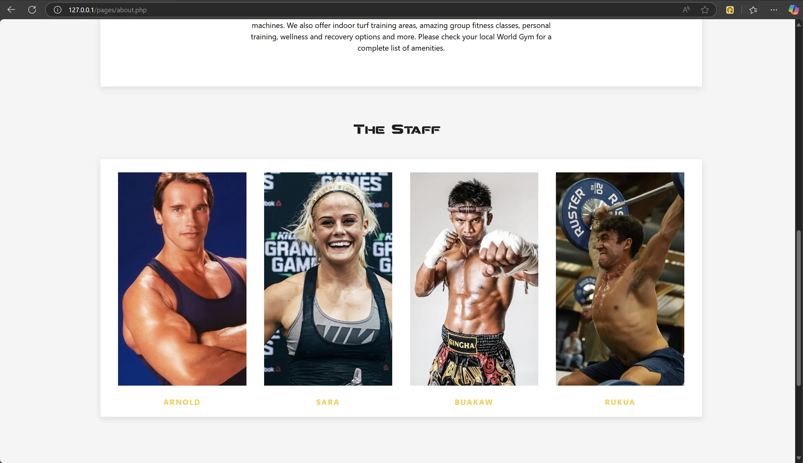

## 📄 Description

This is a <strong>Muay Thai Gym Web App</strong> built in PHP with full <strong>CRUD</strong>. Implementing dynamic code for database and page communication, all is done using <strong>PDO</strong>. 
It has a public and private side for security. The administrator can manage staff members, clients, classes and routines. 
Wheareas, Staff members and clients can login into the Web App using their username and password (passwords are encrypted and decrypted for enhanced security).

- <strong>📋Users Features </strong>
   - Timetable
   - Various Gym classes
   - Personal training programs
   - Booking sheet for trainers
   - Clients login can:
      - View personalised routines 
      - View scheduled classes
   - Staff members login can:
      - Manage clients links 
      - Design and create workouts 
      - Link to classes
   - Administrator login can:
      - Access to everything and manage all system features 

- <strong>⚙️Logic Features </strong>
   - Full CRUD on all data
   - Trainers create programs using the available information
   - Trainers assigning the workout to clients
   - Trainers have the ability to edit workouts
   - Clients have the ability to view their assigned workouts

- <strong>🔒Security Features </strong>
   - Public side for anonymous users.
   - Private side for:
      - Clients to access trainers, classes and exercise routines
      - Trainers to access classes they teach, manage clients and create/edit/assign workouts.
      - Admin to manage accounts, passwords and all system features and data. 
   - Session handling of logins
   - + Encryption/Decryption of passwords

* 🚫🏗️ No frameworks
* 🚫🤖 No AI code 
* 📁 Local content

 The website is optimized for a 16" 2560x1600 display with a 16:10 aspect ratio.

 ## 📷 Screenshots

### index.php

### Pages

### login.php

### dashboard.php

### Private side

### SQL tables

### Encrypted passwords

### functions

## 🛢️ Database Connection

- Name: muaythaigym
- User: <i>mri</i> 
- Password: <i>password</i>
- Host: <i>localhost</i>

🔑 LOGIN Credentials:

- <strong>ADMIN</strong>
   - User: <i>admin</i>
   - Password: <i>admin</i>
   - Position: <i>admin</i>

- <strong>Staff member e.g.</strong>
   - User: <i>arnold</i>
   - Password: <i>password</i>
   - Position: <i>staff</i>
   - <i>(All staffs have the default password set to "password")<i>

- <strong>Client e.g.</strong>
   - User: <i>jill</i>
   - Password: <i>password</i>
   - Position: <i>member</i>
   - <i>(All clients have the default password set to "password")<i>

♦️ You may need a local server and import the database to display the website on your browser. 

## 📒 How to run a local server

You can use MAMP or XAMPP as free options:

https://www.mamp.info/en/windows/

https://www.apachefriends.org/

MAMP EXAMPLE (XAMPP works in the same way):

If you followed the default installation parameters, the directory to run the local server should be on this path: 

   C:\MAMP

Steps to start the server:

1. Start the server by running the <strong>MAMP.exe</strong> file. Next, initiate the Apache Server and MySQL Server if they don't do it automatically

2. At the same directory level where MAMP.exe is located, look for the <strong>htdocs</strong> folder and delete it.

3. Replace the removed <strong>htdocs</strong> folder for the one on this project.

4. In your browser type the following URL: 

   127.0.0.1:80/phpMyAdmin5/

5. Go to home and look for the <strong>User accounts</strong> tab on the top nav bar.

6. Click on <strong>Add user account</strong> and fill it with the following information: 

  - User name: <i>mri</i>
  - Host name: <i>localhost</i>
  - Password: <i>password</i>

7. Below, look for the <strong>global privileges</strong> label and set it to Check all.

8. On the right side nav bar look for New, and create a database with the same name as the SQL file. 

   In this case:  <i>muaythaigym.sql</i>

9. Once it is done, go to the recently created database. Next, on the top nav bar look for the <strong>Import</strong> tab.

10. Browse the SQL file on your computer and click on <strong>Go</strong>.
  

